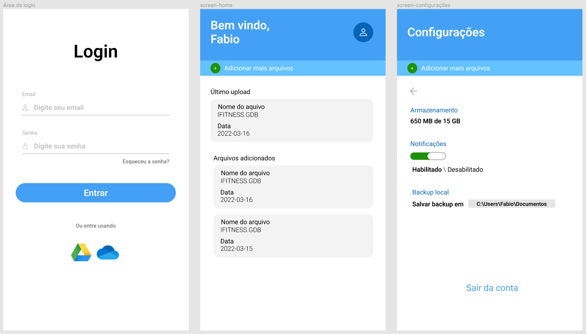

# electronapp-upload-file

## Projeto
Este projeto foi desenvolvido para realizar upload de arquivos de um computador para o outro. Basta o usuário utilizar o mesmo email e senha.

### Projeto final

### Como iniciar?
``npm install``

``npm start``

